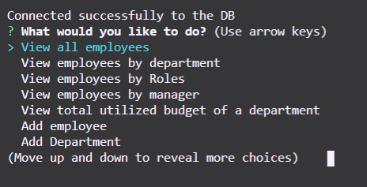
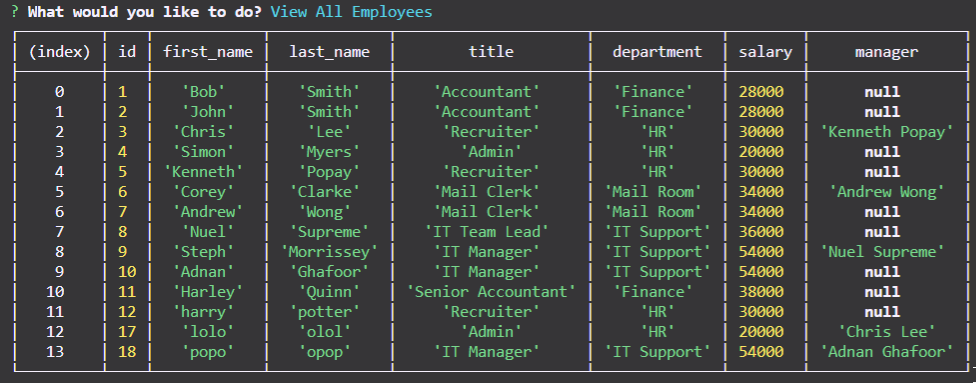
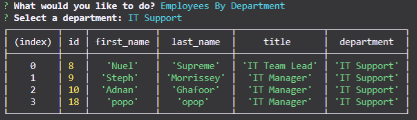
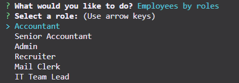
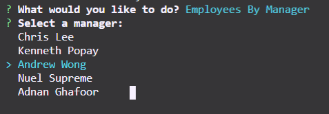
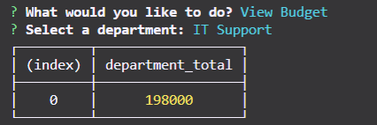
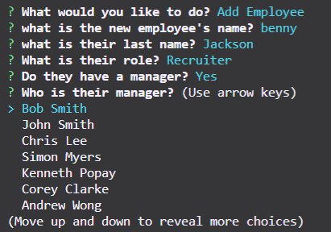
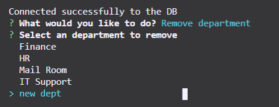
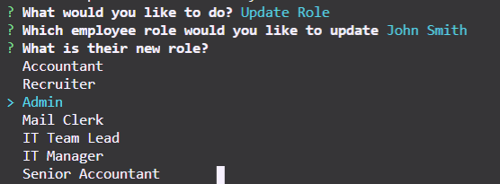

# Employee Tracker Database

This node command line interface (CLI) allows users to access a sql database to edit and bring up lists of employee and their information based on selected criteria, similar to a content management system (CMS). This is done through inquirer for the CMS interface with a connection through MySQL to perform CRUD functionalities (create, read, update, and delete)

## Instillation

To ensure the tracker operates, the user will need to run npm install to make sure the necessary modules are installed (mysql and inquirer). The user will also have to make sure the database is up and running to allow access and the credentials within the "connection" variable (in the app.js file) is correct. Once everything is set up simply enter "npm run start" in the terminal to start the tracker

## Usage

When running the application within the terminal, make sure to follow the steps displayed. When the application is run, the user will be presented with a list of different actionable commands (see image 1) that the they will be able to scroll through.

These commands include:

- View all employees - which brings up a table that joins all 3 database tables to provide the employee names, their roles, department, salary, and manager (if applicable).
- View employees by department - this will show a list of available departments stored in the database. When selected a table of employees based on a department the user has selected will appear.
- View employees by role - this will bring up a list of roles in the database, when a role is selected it will then show a table of employees by the selected role
- View employees by manager - this will then present of employees who manage other employees which then shows which employees they manage when selected
  View budget of a department - this will then show a list of departments currently available which when selected will calculate the total utilised budget which is calculated from the sum of all employee salaries within that department.
- Add employee - This is followed by questions to fill in necessary fields which are input fields for their first and last name, then a list of roles will be presented for the user to select the role the employee. Similarly a verification of whether the employee has a manager will be asked if so then a list of existing employees will be given to choose from.
- Add department - this allows the user to create a new department and insert it into the department table within the database
- Add role - similarly this allows the user to create a new role and insert it into the role table however this will also ask for the salary amount as well as the department the new roles goes into (which will be presented in a list form).
- Remove employee - this allows the user to delete an employee from the database by selecting an employee from the list provided. Other employees with the deleted member as a manager will have them removed as their manager as well
- Remove role - a list of current roles will be generated for the user to select from, once deleted employees within that role are also removed.
- Remove department - this generates a list of departments for the user to select from to delete, once deleted, any roles or employees within that department are also removed.
- Update employee role - a list of all employees will be generated for the user to select from, once selected they will be asked what their new role is and updates the database when selected.
- Update employee manager - a list of employees will be shown as a list for the user to choose from, when selected, another list of employees are generated for the user to select as a manager for the previously selected and the database will be updated accordingly.
- End application - this ends the CMS.

The database uses foreign keys to link up different tables within the database where constraints are applied so that when a department is deleted, all roles and employees within that department are removed as well. Similarly when a role is removed, the employees within that role are also removed however when a manager is removed the employees that have that individual as a manager will just have that manager id removed only and be shown as 'null'.

## Examples

- image 1: Initial Questions
  

- image 3: View all employees
  

- image 4: View employees by department
  

- image 5: View employees by role
  

- image 6: View employees by manager
  

- image 7: view department budget
  

- image 8: Add new employee questions
  

- image: 9: Remove role
  

- image 10: update employee role questions
  
